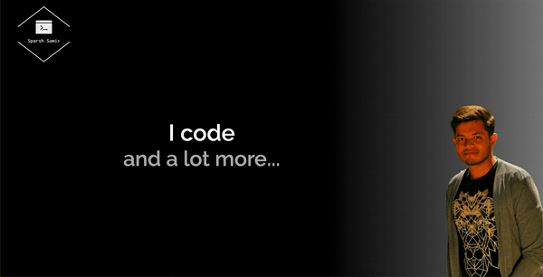

# **Hello, visitor** :sunglasses: :wave:
#### Lovely to see you here.  Fancy a drink ? :tropical_drink:

My name is [Sparsh Samir](https://sparshsamir1993.github.io/onlineresume/) and I am a Full Stack Developer.

I currently live in Waterloo, Canada :canada: 

 

## **Checkout my stats**

**Languages and Tools:**  

<code></code>
<code></code>
<code></code>
<code></code>
<code></code>

- 🔭 I’m currently working on [Covid Management Android App](https://github.com/sparshsamir1993/covid-management-android)
- 🌱 I’m currently learning Kotlin <code></code> , React Native <code></code>

<!--
**sparshsamir1993/sparshsamir1993** is a ✨ _special_ ✨ repository because its `README.md` (this file) appears on your GitHub profile.

Here are some ideas to get you started:

- 🔭 I’m currently working on ...
- 🌱 I’m currently learning ...
- 👯 I’m looking to collaborate on ...
- 🤔 I’m looking for help with ...
- 💬 Ask me about ...
- 📫 How to reach me: ...
- 😄 Pronouns: ...
- ⚡ Fun fact: ...
-->
